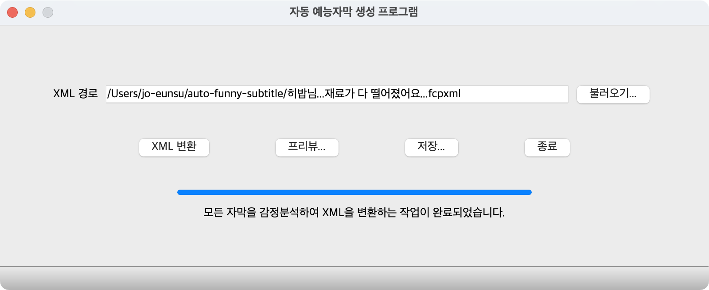

# Auto Funny Subtitle

## 1. 소개

Auto Funny Subtitle(자동 예능자막 지정 프로그램)은 편집자가 동영상 편집 프로그램에서 기본자막을 입힌 프로젝트 파일에서 추출한 XML 파일을 입력하면 XML 안에 있는 자막을 자동 분석해서 예능자막 템플릿을 자동으로 지정한 XML 코드로 변환해주는 프로그램입니다.
현재는 Final Cut Pro XML만 지원합니다.


## 2. 소스코드 빌드

### 2-1. 깃허브 소스코드를 로컬 폴더에 복사
Windows 이용자는 Git Bash를 열고, 맥이나 리눅스 이용자는 터미널을 연 다음 원하는 디렉토리로 이동해서 다음 코드를 복사해 붙여넣습니다.
```
git clone https://github.com/Jo-Eunsu/auto-funny-subtitle
```
### 2-2. Python 및 필수 모듈 설치 (없으신 분들만)

#### (Python 설치 - 최소 3.6 버전 이상)
프로그램을 구동하기 위해서 Python 버전이 최소 3.6 이상이어야 합니다. 컴퓨터에 설치되어 있는 Python의 버전을 확인하고 없거나 버전이 낮으면 3.6 이상의 Python을 설치하시면 됩니다. 
```
git clone https://github.com/Jo-Eunsu/auto-funny-subtitle
```

#### 필수 모듈 설치
소스코드를 Python에서 바로 실행하기 위해서는 PyQt, 2가지 모듈이 필요합니다. 다음 코드를 터미널에 입력하여 모듈을 설치합니다.
```
pip install PyQt5 (대소문자 구별)
pip install azure-ai-textanalytics --pre
```

### 2-3. 프로그램 빌드 및 실행
터미널의 현재 디렉토리를 복사한 디렉토리(auto-funny-subtitle)로 이동시킨 다음 Python을 실행하여 코드를 실행시킵니다. Python 2 이하에서 실행되는 것을 막기 위해 python3 코드로 실행시킵니다.
```
python3 main.py
```


## 3. 사용 설명

### 3-1. 메인 화면

프로그램을 처음 실행시키면 다음과 같은 화면이 뜨게 됩니다. **불러오기** 버튼을 눌러 XML 파일을 불러오면 **XML 변환** 버튼을 눌러 텍스트의 감정을 분석하여 자동으로 예능 자막을 지정한 XML 파일이 생성되게 되고, 이를 **프리뷰** 화면에서 검토하여(기능 아직 구현 안됨) **저장**하거나 변경사항을 폐기할 수 있습니다.